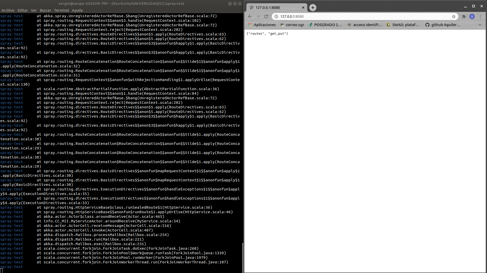

# Ejercicios Tema 2

#### Ejercicio 1: Instalar alguno de los entornos virtuales de node.js (o de cualquier otro lenguaje con el que se esté familiarizado) y, con ellos, instalar la última versión existente, la versión minor más actual de la 4.x y lo mismo para la 0.11 o alguna impar (de desarrollo).

En primer lugar, vamos a instalar el entorno virutal ***nvm***.


Cuya versión es:


**NVM** nos permite instalar diferentes versiones de Nodejs (con el comando ```nvm ls-remote --lts``` vemos todas las versiones disponibles de Nodejs). En nuestro caso instalaremos las siguientes versiones:

***Versión actual (v12.19.0)***


***Versión minor más actual de la 4.x (v4.9.1)***


***Versión 0.11 (v0.11.9)***


A través de ***nvm*** podemos seleccionar una u otra versión mediante el comando ```nvm use <version_nodejs>```. La siguiente imagen muestra todas las versiones de Nodejs que tenemos instaladas:


#### Ejercicio 2: Crear una descripción del módulo usando package.json. En caso de que se trate de otro lenguaje, usar el método correspondiente.

Para crear una descripción del módulo utilizamos el comando: 
```npm init -y```

Con la opción ***-y*** omitimos la personalización básica del .json.


Una vez creado el package.json podemos añadir dependecias de dos formas, utilizando cualquier editor de texto (por ejemplo ***vim***) o utilizando el comando ```npm install <name>@<version>``` .

#### Ejercicio 3: Descargar el repositorio de ejemplo anterior, instalar las herramientas necesarias (principalmente Scala y sbt) y ejecutar el ejemplo desde sbt. Alternativamente, buscar otros marcos para REST en Scala tales como Finatra o Scalatra y probar los ejemplos que se incluyan en el repositorio.

Para este ejercicio clonamos el repositorio del ejemplo usando: ```git clone https://github.com/JJ/spray-test.git```.

Ahora vamos a instalar Scala y sbt. En primer lugar debemos tener java instalado, en mi caso tengo la versión:


El siguiente paso es instalar scala con el comando ```apt install scala```


Ahora instalamos ***sbt*** :

```echo "deb https://dl.bintray.com/sbt/debian /" | sudo tee -a /etc/apt/sources.list.d/sbt.list```

```curl -sL "https://keyserver.ubuntu.com/pks/lookup?op=get&search=0x2EE0EA64E40A89B84B2DF73499E82A75642AC823" | sudo apt-key add```
```sudo apt-get update```
```sudo apt-get install sbt```


Compilamos el código con el comando ```sbt compile``` y ejecutamos el comando ```test```.


El siguiente paso es reiniciar y realizar la prueba de su funcionamiento.




Isertamos un resultado utilizando PUT y hacemos la petición del mismo.


#### Ejercicio 4: Para la aplicación que se está haciendo, escribir una serie de aserciones y probar que efectivamente no fallan. Añadir tests para una nueva funcionalidad, probar que falla y escribir el código para que no lo haga. A continuación, ejecutarlos desde mocha (u otro módulo de test de alto nivel), usando descripciones del test y del grupo de test de forma correcta. Si hasta ahora no has subido el código que has venido realizando a GitHub, es el momento de hacerlo, porque lo vamos a necesitar un poco más adelante.

En el repositorio de la aplicación se a creado el fichero ***Apuesta.js*** que contiene las funciones de la aplicación, este archivo se puede ver en la siguiente imagen:


Por otro lado se ha creado el fichero ***pruebas.js*** con una aserciones básicas para comprobar su correcto funcionamiento. 


Se ha creado una nueva función para ver los nombres del equipo local y visitante como se puede ver en la primera imagen. En primer lugar vamos a hacer que el test falle añadiendo como visitante un equipo erroneo.


Si cambiamos el equipo Sevilla por Betis el test pasa sin problemas.


Ahora vamos a ejecutar los test desde mocha. Creamos el archivos ***test_mocha.js***, el cual indicaremos en el test del package.json.


#### Ejercicio 5: Haced los dos primeros pasos antes de pasar al tercero.
    
En primer lugar nos damos de alta en Travis.


Damos acceso a Travis para el repositorio porrasDeportivas.


Por último, creamos el archivos ***.travis.yml*** que será el encargado de ejecutar el test.

